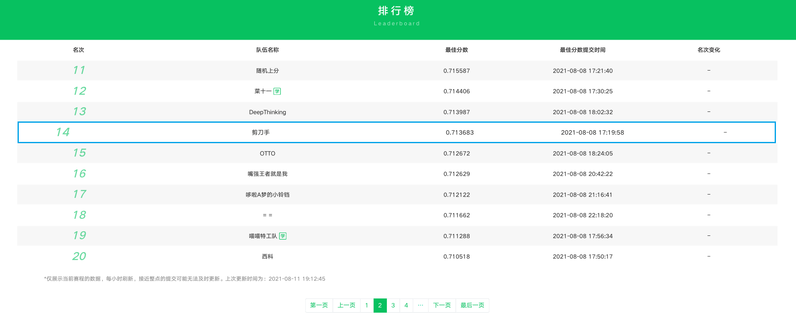

## 1. 环境配置
* Python == 3.6.13
* numba==0.53.1
* scipy==1.4.1
* numpy==1.18.5
* comet_ml==3.10.0
* transformers==4.3.3
* tqdm==4.60.0
* pickle5==0.0.11
* gensim==4.0.1
* torch==1.6.0+cu101
* pandas==1.1.5
* datatable==1.0.0
* scikit_learn==0.24.2


## 2. 代码结构

```shell
.
├── README.md
├── data
│   ├── deepwalk, 随机游走得到的个原始 id 特征的 embedding
│   ├── desc_ocr_asr_200d, 使用原始特征 description、ocr、asr 预训练的词向量
│   ├── desc_ocr_asr_char_200d, 使用原始特征字级别的 description、ocr、asr 预训练的词向量
│   ├── models, 训练好的模型文件
│   ├── processed_data, 经过预处理的训练测试文件
│   ├── submission, 模型推理得到的预测结果，包括单模型结果和融合结果
│   ├── tfidf_kws, 使用 tfidf 得到的 description、ocr、asr 的关键字
│   ├── uid_aid_svd, userid 和 feedid 的奇异值分解向量
│   ├── uid_bgm_singer_id_svd, userid 和 bgm_singer_id 的奇异值分解向量
│   ├── uid_bgm_song_id_svd, userid 和 bgm_song_id 的奇异值分解向量
│   ├── uid_fid_svd, userid 和 feedid 的奇异值分解向量
│   ├── uid_keyword_list_svd, userid 和 keyword_list 的奇异值分解向量
│   ├── uid_tag_list_svd, userid 和 tag_list 的奇异值分解向量
├── inference.sh, 推理启动脚本
├── init.sh, 环境初始化脚本
├── requirements.txt, python 库版本
├── src
│   ├── __init__.py
│   ├── common_path.py, 生成数据目录
│   ├── ensemble.py, 融合结果代码
│   ├── nn
│   │   ├── __init__.py
│   │   ├── activation.py, 激活函数代码
│   │   ├── args.py, 超参代码
│   │   ├── multideepfm4wx.py, nn 模型代码
│   │   ├── test.py, nn 推理代码
│   │   ├── train.py, nn 训练代码
│   │   └── utils.py, nn 辅助函数代码
│   └── prepare.py, 全局特征代码
└── train.sh, nn 训练启动脚本
```

## 3. 运行流程

1. 安装环境：bash init.sh
2. 数据准备及模型训练：bash train.sh
3. 预测并生成结果文件：bash inference.sh

## 4. 模型及特征

### 1. 10\*NN

* 参数 ：
  * learning_rate: 0.01
  * batch_size: 2048
  * l2_reg_embedding 0.1
  * l2 0.0001
  * epochs 3
  * dnn_inputs_dim 337
  * seed 12~21 (10个不同的种子)
  
* 特征
  * 原始特征 (8个)
    * userid
    * feedid
    * device
    * authorid
    * videoplayseconds
    * keyword_list
    * tag_list
    * date_
  * SVD 特征 (128 个)
    * userid 与 feedid 的奇异值分解 (64 维)
  * DeepWalk 特征 (128个)
    * userid 与 feedid  (64 维)
  * feed embedding (512 维)

  
## 5. 算法性能

1. 总预测时长：3160 s
2. 平均预测时长：212.332 ms


## 6. 代码说明

1. 路径：src/nn/test.py
2. 行数：62
3. 内容：logits = model(\*\*batch\_cuda)\[3\]



